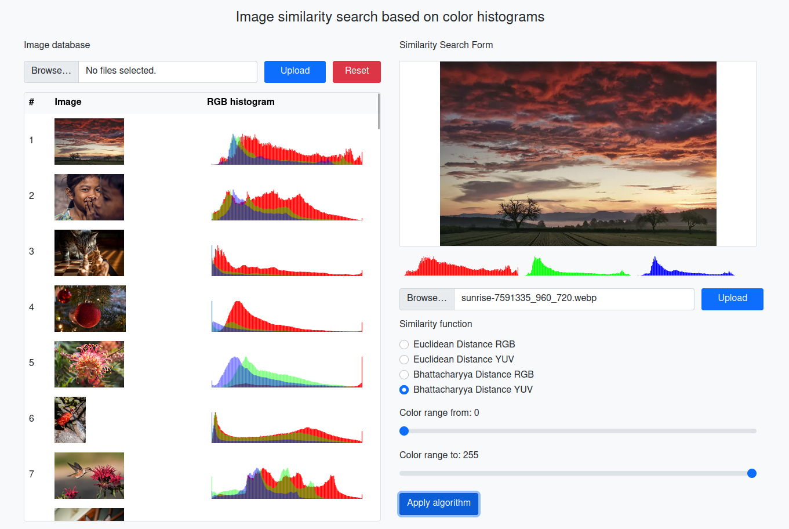

# image-similarity-search

Web application for simple image similarity retrieval based on color histograms using Euclidean distance and Bhattacharyya coefficient on both RGB and YUV color models.

Stack
-----

- PHP8, Nette
- TypeScript, React, Sass
- Docker, MariaDB

Setup
-----

    cp .env.dist .env
    cp application/config/local.neon.dist application/config/local.neon

Run docker project
------------

	docker-compose build
	docker-compose up

Installation
------------

	cd application
	composer install
	yarn install

Import sql/images.sql to database.

Compile assets
--------------

	yarn build
